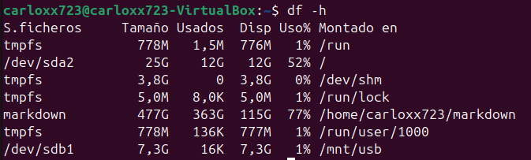
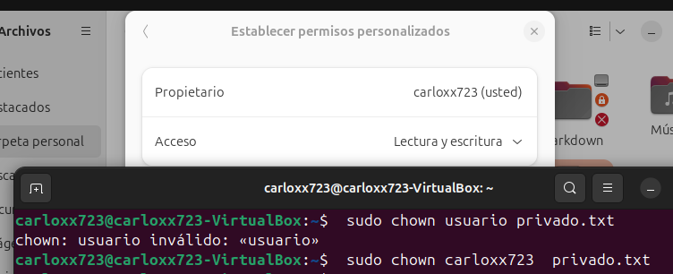

# Carlos Alberto Gonzalez Sosa -  Sistemas operativos 

## Actividades - Profe por favor paseme

### Administración de Memoria
 #### 3.1 Política y filosofía

 1. ¿Cuál es la diferencia entre fragmentación interna y externa?

    La fragmentación interna ocurre cuando un bloque de memoria es más grande que el tamaño solicitado y se desperdicia el exceso de espacio. La fragmentación externa ocurre cuando hay espacios entre los bloques asignados y la memoria no se puede usar para solicitudes más grandes.

    El principal problema de la fragmentacion interna es que aunque el espacio no está siendo usado por el proceso, está reservado y no puede ser asignado a otros procesos, y el de la fragmentacion externa es que a pesar de tener suficiente memoria libre, los bloques no contiguos impiden la asignación. 

 2. Investiga y explica las políticas de reemplazo de páginas en sistemas
 operativos. ¿Cuál consideras más eficiente y por qué?

    Las políticas de reemplazo de páginas son algoritmos que deciden qué página eliminar de la memoria principal cuando está llena y es necesario cargar una nueva página.

    <u>Política FIFO </u>

    FIFO significa primero en entrar, primero en salir, lo que significa que la página que ha estado en la memoria por más tiempo es la que se reemplaza. Esta directiva es sencilla y fácil de implementar, pero puede provocar altas tasas de errores de página y un uso deficiente de la memoria.

    <u>Política de LRU</u>
    
    LRU son las siglas de Least-Recently Used, lo que significa que la página a la que se ha accedido menos recientemente es la que se reemplaza. Esta política trata de capturar la localidad temporal de referencia, que es la tendencia de los programas a acceder a las mismas páginas repetidamente en un corto período de tiempo.

    <u>Política de LFU</u>

    LFU significa Less-Frequently Used, lo que significa que la página a la que se ha accedido con menos frecuencia es la que se reemplaza. Esta política trata de capturar la frecuencia de la localidad de referencia, que es la tendencia de los programas a acceder a algunas páginas con más frecuencia que a otras a largo plazo.

    <u>Política de OPT</u>

    OPT significa Optimal, lo que significa que la página que no se utilizará durante más tiempo en el futuro es la que se reemplaza.

    Para mi la mas eficiente es LFU ya que elimina la que menos se ha usado a lo largo del tiempo y esto evita tener asignado espacio en espacios que no se usan, aunque depende del conexto del sistema la politica que se tenga que elegir para el reemplazo de paginas.
    
  #### 3.2 Memoria real
 1. Escribe un programa en C o Python que simule la administración de
 memoria mediante particiones fijas.

```py
class MemoriaFija:
    def __init__(self, particiones):
        self.particiones = [{"tamaño": tamaño, "proceso": None} for tamaño in particiones]

    def mostrarEstado(self):
        print("\nEstado de la Memoria:")
        for i, particion in enumerate(self.particiones):
            estado = f"Proceso {particion['proceso']}" if particion['proceso'] else "Libre"
            print(f"Partición {i + 1} (Tamaño: {particion['tamaño']} MB): {estado}")
        print("")

    def asignarProceso(self, idProceso, tamañoProceso, particionSeleccionada):
        if particionSeleccionada < 1 or particionSeleccionada > len(self.particiones):
            print("Error: Partición seleccionada no es válida.")
            return

        particion = self.particiones[particionSeleccionada - 1]

        if particion["proceso"] is None and particion["tamaño"] >= tamañoProceso:
            particion["proceso"] = idProceso
            print(f"Proceso {idProceso} asignado a la Partición {particionSeleccionada}")
        else:
            print(f"No se pudo asignar el Proceso {idProceso} a la Partición {particionSeleccionada}.")
            print(f"Partición ocupada o tamaño insuficiente.")
        
        self.mostrarEstado()

    def liberarProceso(self, idProceso):
        for i, particion in enumerate(self.particiones):
            if particion["proceso"] == idProceso:
                particion["proceso"] = None
                print(f"Proceso {idProceso} liberado de la Partición {i + 1}")
                self.mostrarEstado()
                return
        print(f"No se encontró el Proceso {idProceso} en ninguna partición.")
        self.mostrarEstado()


def menu():
    print("1. Asignar proceso")
    print("2. Liberar proceso")
    print("3. Salir")


def main():
    particiones = [100, 100, 100, 100, 100]  
    memoria = MemoriaFija(particiones)

    memoria.mostrarEstado()

    while True:
        menu()
        opcion = input("Selecciona una opción: ")

        if opcion == "1":
            idProceso = input("Ingresa el ID del proceso: ")
            tamañoProceso = input("Ingresa el tamaño del proceso: ")
            tamañoProceso = int(tamañoProceso)

            particionSeleccionada = int(input(f"Selecciona la partición a la que asignar el proceso : "))
            memoria.asignarProceso(idProceso, tamañoProceso, particionSeleccionada)

        elif opcion == "2":
            idProceso = input("Ingresa el ID del proceso a liberar: ")
            memoria.liberarProceso(idProceso)

        elif opcion == "3":
            print("Saliendo del programa...")
            break

        else:
            print("Opción inválida. Inténtalo de nuevo.")
            memoria.mostrarEstado()


if __name__ == "__main__":
    main()

```


 2. Diseña un algoritmo para calcular qué procesos pueden ser asignados
 a un sistema con memoria real limitada utilizando el algoritmo de
 "primera cabida"

```py
   class MemoriaFija:
    def __init__(self, particiones):
        self.particiones = [{"tamaño": tamaño, "proceso": None} for tamaño in particiones]

    def mostrarEstado(self):
        print("\nEstado de la Memoria:")
        for i, particion in enumerate(self.particiones):
            estado = f"Proceso {particion['proceso']}" if particion['proceso'] else "Libre"
            print(f"Partición {i + 1} ({particion['tamaño']} MB): {estado}")
        print("")

    def asignarProceso(self, idProceso, tamañoProceso):
        for i, particion in enumerate(self.particiones):
            if particion["proceso"] is None and tamañoProceso <= particion["tamaño"]:
                particion["proceso"] = idProceso
                print(f"Proceso {idProceso} asignado a la Partición {i + 1}")
                self.mostrarEstado()
                return
        print(f"No se pudo asignar el Proceso {idProceso}: No hay particiones libres adecuadas.")
        self.mostrarEstado()

    def liberarProceso(self, idProceso):
        for i, particion in enumerate(self.particiones):
            if particion["proceso"] == idProceso:
                particion["proceso"] = None
                print(f"Proceso {idProceso} liberado de la Partición {i + 1}")
                self.mostrarEstado()
                return
        print(f"No se encontró el Proceso {idProceso} en ninguna partición.")
        self.mostrarEstado()


def menu():
    print("1. Asignar proceso")
    print("2. Liberar proceso")
    print("3. Salir")


def main():
    particiones = [100, 200, 100, 430, 250]
    memoria = MemoriaFija(particiones)

    memoria.mostrarEstado()

    while True:
        menu()
        opcion = input("Selecciona una opción: ")

        if opcion == "1":
            idProceso = input("Ingresa el ID del proceso: ")
            tamañoProceso = input("Ingresa el tamaño del proceso: ")
            tamañoProceso = int(tamañoProceso)
            memoria.asignarProceso(idProceso, tamañoProceso)


        elif opcion == "2":
            idProceso = input("Ingresa el ID del proceso a liberar: ")
            memoria.liberarProceso(idProceso)

        elif opcion == "3":
            print("Saliendo del programa...")
            break

        else:
            print("Opción inválida. Inténtalo de nuevo.")
            memoria.mostrarEstado()


if __name__ == "__main__":
    main()
    
```


 #### 3.3 Organización de memoria virtual

 1. Investiga y explica el concepto de "paginación" y "segmentación".
 ¿Cuáles son las ventajas y desventajas de cada técnica?

  <u>¿Qué es la paginación? </u>

   La paginación es un mecanismo que implementa la memoria virtual mediante la administración de la transferencia de páginas entre la memoria física y el disco. La paginación implica dos componentes: una tabla de páginas y un controlador de errores de página.

   <u>¿Cómo funciona la paginación?</u>

   La paginación funciona dividiendo la memoria física y el disco en bloques de igual tamaño llamados tramas y sectores, respectivamente. Cada marco y sector puede contener una página de datos. Cuando una aplicación o un proceso solicita una página de datos, el sistema operativo comprueba la tabla de páginas para ver si la página está en la memoria física o en el disco. Si la página está en memoria física, el sistema operativo accede a ella directamente. Si la página está en el disco, el sistema operativo desencadena un error de página e invoca el controlador de errores de página.

   <u>Ventajas y desventajas de la paginación</u>
   
   | **Ventajas**                      | **Desventajas**                     |
   |-----------------------------------|-------------------------------------|
   | Elimina la fragmentación externa  | Introduce fragmentación interna     |
   | Gestión flexible de la memoria    | Requiere tablas de páginas          |
   | Facilita memoria virtual          | Mayor tiempo en acceso a memoria    |
   | Aprovecha el espacio disponible   | Sobrecarga en la gestión del sistema|
   | Asignación no contigua            | Tamaño fijo de página puede ser ineficiente |


   <u>¿Qué es la segmentación? </u>

   La segmentación es una técnica de gestión de memoria que divide la memoria física de una computadora en segmentos de tamaño variable, cada uno de los cuales se puede asignar a un proceso o programa diferente. La segmentación permite un uso más eficiente de la memoria, la protección de los datos y el intercambio de código entre procesos.

   <u> Tipos de segmentación </u>

   Hay dos tipos principales de segmentación en los sistemas operativos: estática y dinámica. La segmentación estática es cuando los segmentos se fijan en tamaño y ubicación en tiempo de compilación o tiempo de carga. La segmentación dinámica es cuando los segmentos son variables en tamaño y ubicación en tiempo de ejecución. 

   <u>Ventajas y desventajas de la segmentación</u>

   | **Ventajas**                                   | **Desventajas**                              |
   |-----------------------------------------------|---------------------------------------------|
   | Evita la fragmentación interna                | Introduce fragmentación externa             |
   | Permite tamaños de segmentos variables        | Mayor complejidad en la gestión de memoria  |
   | Facilita la organización lógica de los datos  | Acceso más lento que en paginación          |
   | Mejora la eficiencia de uso de la memoria     | Requiere tablas de segmentos                |
   | Segmentación basada en las necesidades del programa | Mayor sobrecarga para el sistema           |


 2. Escribe un programa que simule una tabla de páginas para procesos
 con acceso aleatorio a memoria virtual.

#### 3.4 Administración de memoria virtual

 1. Escribe un código que implemente el algoritmo de reemplazo de página "Least Recently Used" (LRU).
 ```c
#include <stdio.h>
#include <stdlib.h>

#define CAPACIDAD_CACHE 4  

typedef struct Nodo {
    int pagina;              
    struct Nodo* prev;      
    struct Nodo* next;      
} Nodo;


typedef struct CacheLRU {
    int tamaño;              
    Nodo* cabeza;            
    Nodo* cola;               
} CacheLRU;

Nodo* crearNodo(int pagina) {
    Nodo* nuevo = (Nodo*)malloc(sizeof(Nodo));
    nuevo->pagina = pagina;
    nuevo->prev = nuevo->next = NULL;
    return nuevo;
}

CacheLRU* inicializarCacheLRU() {
    CacheLRU* cache = (CacheLRU*)malloc(sizeof(CacheLRU));
    cache->tamaño = 0;
    cache->cabeza = cache->cola = NULL;
    return cache;
}

void moverACabeza(CacheLRU* cache, Nodo* nodo) {
    if (cache->cabeza == nodo) return;

    if (nodo->prev) nodo->prev->next = nodo->next;
    if (nodo->next) nodo->next->prev = nodo->prev;

    if (cache->cola == nodo) cache->cola = nodo->prev;

    nodo->next = cache->cabeza;
    nodo->prev = NULL;
    if (cache->cabeza) cache->cabeza->prev = nodo;
    cache->cabeza = nodo;

    if (cache->tamaño == 1) cache->cola = nodo;
}

void agregarPagina(CacheLRU* cache, int pagina) {
    Nodo* nuevo = crearNodo(pagina);

    if (cache->tamaño == 0) {
        cache->cabeza = cache->cola = nuevo;
    }
    else {
        if (cache->tamaño < CAPACIDAD_CACHE) {
            nuevo->next = cache->cabeza;
            cache->cabeza->prev = nuevo;
            cache->cabeza = nuevo;
        }
        else {
            Nodo* temp = cache->cola;
            cache->cola = temp->prev;
            if (cache->cola) cache->cola->next = NULL;
            printf("Página %d eliminada de la caché.\n", temp->pagina); // Mensaje de eliminación
            free(temp);

            nuevo->next = cache->cabeza;
            cache->cabeza->prev = nuevo;
            cache->cabeza = nuevo;
        }
    }

    if (cache->tamaño < CAPACIDAD_CACHE) cache->tamaño++;
}

void accederPagina(CacheLRU* cache, int pagina) {
    Nodo* temp = cache->cabeza;

    while (temp) {
        if (temp->pagina == pagina) {
            moverACabeza(cache, temp);
            printf("Página %d encontrada y movida a la cabeza.\n", pagina);
            return;
        }
        temp = temp->next;
    }

    printf("Página %d no encontrada, agregando a la caché.\n", pagina);
    agregarPagina(cache, pagina);
}

void mostrarCache(CacheLRU* cache) {
    Nodo* temp = cache->cabeza;
    printf("Contenido de la caché: ");
    while (temp) {
        printf("%d ", temp->pagina);
        temp = temp->next;
    }
    printf("\n");
}


int main() {
    CacheLRU* cache = inicializarCacheLRU();


    accederPagina(cache, 1);
    mostrarCache(cache);
    accederPagina(cache, 2);
    mostrarCache(cache);
    accederPagina(cache, 3);
    mostrarCache(cache);
    accederPagina(cache, 4);
    mostrarCache(cache);
    accederPagina(cache, 1);
    mostrarCache(cache);
    accederPagina(cache, 2);
    mostrarCache(cache);
    accederPagina(cache, 3);
    mostrarCache(cache);
    accederPagina(cache, 1);  
    mostrarCache(cache);
    accederPagina(cache, 5);  
    mostrarCache(cache);

    return 0;
}

 ```


 2. Diseña un diagrama que represente el proceso de traducción de direc
ciones virtuales a físicas en un sistema con memoria virtual


    

#### Integración
 1. Analiza un sistema operativo moderno (por ejemplo, Linux o Windows)
 e identifica cómo administra la memoria virtual.

    Por lo que he podido ver a lo largo de mi experiancia como usuario de windows es que utiliza tecnicas de paginacion, tlb, compresion de memoria y memoria virtual esto lo he podido ver ya que cuando cargas un proceso por primera vez lo hace mas lento debido a la paginacion y  mientras mas lo utilzas mas rapido realiza la carga debido al TLB, tambien he notado que cuando la memoria ram se agota hace uso de memoria virtual empeorando el rendimiento, esto lo he notado en videojuegos. 

 2. Realiza una simulación en cualquier lenguaje de programación que
 emule el swapping de procesos en memoria virtual

    ```py
        import random
    import time
    from collections import deque

    capacidadMemoria = 3
    disco = []

    def swapOut(memoria):
        procesoSacado = memoria.pop(0)
        print(f"Intercambiando proceso {procesoSacado} de memoria al disco.")
        disco.append(procesoSacado)

    def agregarAMemoria(memoria, proceso):
        if len(memoria) < capacidadMemoria:
            memoria.append(proceso)
            print(f"Proceso {proceso} agregado a memoria.")
        else:
            swapOut(memoria)
            memoria.append(proceso)
            print(f"Proceso {proceso} agregado a memoria.")

    def simularSwap():
        memoria = []
        procesos = ['P1', 'P2', 'P3', 'P4', 'P5', 'P6', 'P7']
        
        for i in range(10):
            procesoNuevo = random.choice(procesos)
            print(f"\nAgregando proceso {procesoNuevo}")
            
            agregarAMemoria(memoria, procesoNuevo)
            
            print(f"Estado de memoria: {memoria}")
            print(f"Estado del disco: {disco}")
            
            time.sleep(1)

    simularSwap()

    ```


  ### Administración de Entrada/Salida
 #### 4.1 Dispositivos y manejadores de dispositivos

 1. Explica la diferencia entre dispositivos de bloque y dispositivos de carácter. Da un ejemplo de cada uno.

    <u>Dispositivos de bloque</u>: se caracterizan por transferir la información en grupos de tamaño fijo, denominados bloques. Como ejemplo tenemos el disco magnético.
    
    <u>Dispositivos de tipo carácter</u>: pueden transmitir la información carácter a carácter. Ejemplo: un modem.

 2. Diseña un programa que implemente un manejador de dispositivos sen
cillo para un dispositivo virtual de entrada.

```c
#include <stdio.h>
#include <stdlib.h>
#include <string.h>

typedef struct {
    char buffer[256];
    int isOpen;
} DispositivoEntrada;

int abrirDispositivo(DispositivoEntrada* dispositivo) {
    if (dispositivo->isOpen) {
        printf("El dispositivo ya está abierto.\n");
        return -1;
    }
    dispositivo->isOpen = 1;
    printf("Dispositivo abierto con éxito.\n");
    return 0;
}

void cerrarDispositivo(DispositivoEntrada* dispositivo) {
    if (!dispositivo->isOpen) {
        printf("El dispositivo ya está cerrado.\n");
        return;
    }
    dispositivo->isOpen = 0;
    printf("Dispositivo cerrado con éxito.\n");
}

int leerDatos(DispositivoEntrada* dispositivo) {
    if (!dispositivo->isOpen) {
        printf("El dispositivo no está abierto.\n");
        return -1;
    }
    
    printf("Datos en el buffer: %s\n", dispositivo->buffer);
    return 0;
}

int escribirDatos(DispositivoEntrada* dispositivo) {
    if (!dispositivo->isOpen) {
        printf("El dispositivo no está abierto.\n");
        return -1;
    }
    
    printf("Escriba los datos para almacenar en el buffer: ");
    fgets(dispositivo->buffer, sizeof(dispositivo->buffer), stdin);
    
    size_t len = strlen(dispositivo->buffer);
    if (len > 0 && dispositivo->buffer[len - 1] == '\n') {
        dispositivo->buffer[len - 1] = '\0';
    }

    printf("Datos escritos en el buffer: %s\n", dispositivo->buffer);
    return 0;
}

void mostrarMenu() {
    printf("\nMenu \n");
    printf("1. Escribir en el buffer\n");
    printf("2. Leer del buffer\n");
    printf("3. Salir\n");
    printf("Seleccione una opción: ");
}

int main() {
    DispositivoEntrada dispositivo = { .isOpen = 0 };
    int opcion;
    
    if (abrirDispositivo(&dispositivo) != 0) {
        return -1;
    }

    do {
        mostrarMenu();
        scanf("%d", &opcion);
        getchar();
        
        switch (opcion) {
            case 1:
                escribirDatos(&dispositivo);
                
                break;
            case 2:
                leerDatos(&dispositivo);
                break;
            case 3:
                printf("Saliendo del programa...\n");
                break;
            default:
                printf("Opción no válida, intente nuevamente.\n");
                break;
        }
    } while (opcion != 3);

    cerrarDispositivo(&dispositivo);
    return 0;
}

```


 
 #### 4.2 Mecanismos y funciones de los manejadores de dispositivos
 1. Investiga qué es la interrupción por E/S y cómo la administra el sistema operativo. Escribe un ejemplo en pseudocódigo para simular este proceso.
 
 Una interrupción por E/S son aquellas que se producen cuando un disposito de entrada o salida genera  una operacion de E/S, no son producidas por ninguna instrucción de un programa sino por las señales que emiten los dispositivos periféricos para indicarle al procesador que necesitan ser atendidos.

Proceso para la gestion de interrupciones por E/S

1. Un proceso solicita leer datos de un dispositivo (por ejemplo, un disco).
2. El sistema operativo coloca la solicitud en una cola de E/S.
3. El dispositivo de E/S genera una interrupción cuando está listo para procesar la solicitud.
4. El procesador interrumpe el proceso actual y maneja la interrupción.
5. El controlador de dispositivo realiza la operación de lectura/escritura en el dispositivo.
6. Una vez completada la operación, el dispositivo genera una nueva interrupción para notificar al procesador.
7. El procesador reanuda el proceso original y le indica que la operación de E/S ha terminado.

```
Inicio 

    Proceso solicita leer datos de un dispositivo

    SO coloca la solicitud en una cola de E/S

    El dispositivo de E/S esta listo?
    si:
        procesador interrumpe el proceso actual y maneja la interrupción

        el controlador de dispositivo realiza la operación de lectura/escritura en el dispositivo

        termino?
        si:
            el dispositivo genera una nueva interrupción para notificar al procesador
            El procesador reanuda el proceso original
        no:
            el dispositivo continua con la operacion 
    no:
        el procesador continua con el proceso que este ejcutanto
    
Fin

```


 2. Escribe un programa que utilice el manejo de interrupciones en un
 sistema básico de simulación.

```c
#include <stdio.h>
#include <stdlib.h>
#include <signal.h>
#include <unistd.h>

void manejadorInterrupcion(int numeroSenal) {
    printf("\nSeñal recibida: %d\n", numeroSenal);
    if (numeroSenal == SIGINT) {
        printf("Finalzando proceso\n");
        exit(0);
    } else if (numeroSenal == SIGUSR1) {
        printf("Proceso iniciado por el usuario.\n");
    } else if (numeroSenal == SIGALRM) {
        printf("Se recibió un temporizador (alarma).\n");
    }
}

void configurarManejadores() {
    signal(SIGINT, manejadorInterrupcion);  // Ctrl+C
    signal(SIGUSR1, manejadorInterrupcion); //  kill -SIGUSR1 <PID>
    signal(SIGALRM, manejadorInterrupcion); // senal automatica
}

void ejecutarTareas() {
    while (1) {
        printf("Ejecutando proceso principal\n");
        sleep(3); 
        printf("Esperando interrupcion\n");

        alarm(3); 
    }
}


int main() {
    configurarManejadores();
    ejecutarTareas();
    return 0;
}

```


 #### 4.3 Estructuras de datos para manejo de dispositivos

 1. Investiga y explica qué es una cola de E/S. Diseña una simulación de una cola con prioridad.

    Las colas de E/S son contenedores para las solicitudes de E/S que recibe un controlador. Cada controlador puede crear una o varias colas de E/S para cada dispositivo. 

```c
#include <stdio.h>
#include <stdlib.h>
#include <string.h>

typedef struct Nodo {
    int prioridad;         
    char nombre[100];        
    struct Nodo* siguiente; 
} Nodo;

typedef struct {
    Nodo* frente;
} ColaPrioridad;

Nodo* crearNodo(int prioridad, char* nombre) {
    Nodo* nuevoNodo = (Nodo*)malloc(sizeof(Nodo));
    nuevoNodo->prioridad = prioridad;
    strcpy(nuevoNodo->nombre, nombre);
    nuevoNodo->siguiente = NULL;
    return nuevoNodo;
}

void inicializarCola(ColaPrioridad* cola) {
    cola->frente = NULL;
}

void insertar(ColaPrioridad* cola, int prioridad, char* nombre) {
    Nodo* nuevoNodo = crearNodo(prioridad, nombre);

    if (cola->frente == NULL || prioridad < cola->frente->prioridad) {
        nuevoNodo->siguiente = cola->frente;
        cola->frente = nuevoNodo;
    } else {
        Nodo* actual = cola->frente;
        while (actual->siguiente != NULL && actual->siguiente->prioridad <= prioridad) {
            actual = actual->siguiente;
        }
        nuevoNodo->siguiente = actual->siguiente;
        actual->siguiente = nuevoNodo;
    }
    printf("'%s' insertado con prioridad %d \n",  nombre,prioridad);
}

void eliminar(ColaPrioridad* cola) {

    Nodo* temp = cola->frente;
    printf("'%s' eliminado.\n", temp->nombre);
    cola->frente = cola->frente->siguiente;
    free(temp);
}

void mostrar(ColaPrioridad* cola) {
    if (cola->frente == NULL) {
        printf("La cola está vacía.\n");
        return;
    }
    Nodo* actual = cola->frente;
    printf("Cola de prioridad: \n");
    while (actual != NULL) {
        printf("[%s, Prioridad: %d] -> ",actual->nombre,actual->prioridad);
        actual = actual->siguiente;
    }
    printf("NULL\n");
}

int main() {
    ColaPrioridad cola;
    inicializarCola(&cola);

    insertar(&cola, 3, "p1");
    insertar(&cola, 1, "p2");
    insertar(&cola, 2, "p3");
    insertar(&cola, 4, "p4");

    mostrar(&cola);

    eliminar(&cola);
    mostrar(&cola);

    eliminar(&cola);
    mostrar(&cola);

    eliminar(&cola);
    mostrar(&cola);

    eliminar(&cola);
    mostrar(&cola);

    return 0;
}

```


 2. Escribe un programa que simule las operaciones de un manejador de
 dispositivos utilizando una tabla de estructuras.

```c
#include <stdio.h>
#include <stdlib.h>
#include <string.h>

#define MAX_DISPOSITIVOS 5

typedef struct {
    char buffer[256];
    int isOpen;
} DispositivoEntrada;

DispositivoEntrada tablaDispositivos[MAX_DISPOSITIVOS];

int abrirDispositivo(DispositivoEntrada* dispositivo) {
    if (dispositivo->isOpen) {
        printf("El dispositivo ya está abierto.\n");
        return -1;
    }
    dispositivo->isOpen = 1;
    printf("Dispositivo abierto con éxito.\n");
    return 0;
}

void cerrarDispositivo(DispositivoEntrada* dispositivo) {
    if (!dispositivo->isOpen) {
        printf("El dispositivo ya está cerrado.\n");
        return;
    }
    dispositivo->isOpen = 0;
    printf("Dispositivo cerrado con éxito.\n");
}

int leerDatos(DispositivoEntrada* dispositivo) {
    if (!dispositivo->isOpen) {
        printf("El dispositivo no está abierto.\n");
        return -1;
    }
    printf("Datos en el buffer: %s\n", dispositivo->buffer);
    return 0;
}

int escribirDatos(DispositivoEntrada* dispositivo) {
    if (!dispositivo->isOpen) {
        printf("El dispositivo no está abierto.\n");
        return -1;
    }

    printf("Escriba los datos para almacenar en el buffer: ");
    fgets(dispositivo->buffer, sizeof(dispositivo->buffer), stdin);

    size_t len = strlen(dispositivo->buffer);
    if (len > 0 && dispositivo->buffer[len - 1] == '\n') {
        dispositivo->buffer[len - 1] = '\0';
    }

    printf("Datos escritos en el buffer: %s\n", dispositivo->buffer);
    return 0;
}

void mostrarMenu() {
    printf("\nMenu \n");
    printf("1. Escribir en el buffer\n");
    printf("2. Leer del buffer\n");
    printf("3. Salir\n");
    printf("Seleccione una opción: ");
}

int seleccionarDispositivo() {
    int id;
    printf("\nSeleccione el dispositivo (0 a %d): ", MAX_DISPOSITIVOS - 1);
    scanf("%d", &id);
    getchar();
    if (id < 0 || id >= MAX_DISPOSITIVOS) {
        printf("Dispositivo no válido.\n");
        return -1;
    }
    return id;
}

int main() {
    for (int i = 0; i < MAX_DISPOSITIVOS; i++) {
        tablaDispositivos[i].isOpen = 1;
    }

    int opcion, dispositivoSeleccionado;

    do {
        dispositivoSeleccionado = seleccionarDispositivo();
        if (dispositivoSeleccionado == -1) continue;

        do {
            mostrarMenu();
            scanf("%d", &opcion);
            getchar();

            switch (opcion) {
                case 1:
                    escribirDatos(&tablaDispositivos[dispositivoSeleccionado]);
                    break;
                case 2:
                    leerDatos(&tablaDispositivos[dispositivoSeleccionado]);
                    break;
                case 3:
                    printf("Saliendo del dispositivo seleccionado...\n");
                    break;
                default:
                    printf("Opción no válida, intente nuevamente.\n");
                    break;
            }
        } while (opcion != 3);

    } while (1);
    cerrarDispositivo(&tablaDispositivos[dispositivoSeleccionado]);

    return 0;
}

```

 #### 4.4 Operaciones de Entrada/Salida

 1. Diseña un flujo que describa el proceso de lectura de un archivo desde un disco magnético. Acompáñalo con un programa básico que simule
 el proceso.


```c
#include <stdio.h>
#include <stdlib.h>
#include <string.h>

#define MAX_ARCHIVOS 5
#define MAX_SECTORES 5
#define TAMANIO_SECTOR 128

typedef struct {
    char contenido[TAMANIO_SECTOR];
    int ocupado;
    int archivoID;
} Sector;

typedef struct {
    Sector sectores[MAX_SECTORES];
} Disco;

typedef struct {
    int archivoID;
    int sectorInicio;
    int sectoresTotales;
} Archivo;

void inicializarDisco(Disco *disco) {
    for (int i = 0; i < MAX_SECTORES; i++) {
        disco->sectores[i].ocupado = 0;
        disco->sectores[i].archivoID = -1;
    }
}

void escribirArchivo(Disco *disco, Archivo *archivo, const char *contenido) {
    for (int i = 0; i < archivo->sectoresTotales; i++) {
        int sectorIndex = archivo->sectorInicio + i;
        if (sectorIndex < MAX_SECTORES) {
            strncpy(disco->sectores[sectorIndex].contenido, contenido, TAMANIO_SECTOR);
            disco->sectores[sectorIndex].ocupado = 1;
            disco->sectores[sectorIndex].archivoID = archivo->archivoID;
        }
    }
    printf("Archivo %d escrito en el disco.\n", archivo->archivoID);
}

void leerArchivo(Disco *disco, Archivo *archivo) {
    printf("Leyendo archivo %d desde el disco...\n", archivo->archivoID);
    for (int i = 0; i < archivo->sectoresTotales; i++) {
        int sectorIndex = archivo->sectorInicio + i;
        if (sectorIndex < MAX_SECTORES && disco->sectores[sectorIndex].ocupado) {
            printf("Sector %d: %s\n", sectorIndex, disco->sectores[sectorIndex].contenido);
        } else {
            printf("Sector %d vacío.\n", sectorIndex);
        }
    }
}

Archivo* buscarArchivo(Disco *disco, int archivoID) {
    static Archivo archivoEncontrado;
    for (int i = 0; i < MAX_SECTORES; i++) {
        if (disco->sectores[i].ocupado && disco->sectores[i].archivoID == archivoID) {
            archivoEncontrado.archivoID = archivoID;
            archivoEncontrado.sectorInicio = i;
            archivoEncontrado.sectoresTotales = 1;
            return &archivoEncontrado;
        }
    }
    return NULL;
}

int main() {
    Disco disco;
    inicializarDisco(&disco);

    int archivoID;
    char contenido[TAMANIO_SECTOR];

    Archivo archivo1 = {1, 0, 1};
    Archivo archivo2 = {2, 1, 1};
    Archivo archivo3 = {3, 2, 1};

    escribirArchivo(&disco, &archivo1, "Contenido del archivo 1");
    escribirArchivo(&disco, &archivo2, "Contenido del archivo 2");
    escribirArchivo(&disco, &archivo3, "Contenido del archivo 3");

    int opcion;

    do {
        printf("\nMenu:\n");
        printf("1. Buscar archivo por ID\n");
        printf("2. Salir\n");
        printf("Seleccione una opción: ");
        scanf("%d", &opcion);
        getchar();

        if (opcion == 1) {
            printf("Ingrese el ID del archivo a buscar: ");
            scanf("%d", &archivoID);

            Archivo *archivoEncontrado = buscarArchivo(&disco, archivoID);

            if (archivoEncontrado != NULL) {
                leerArchivo(&disco, archivoEncontrado);
            } else {
                printf("Archivo con ID %d no encontrado.\n", archivoID);
            }
        }
    } while (opcion != 2);

    return 0;
}

```


 2. Implementa un programa en Python, C o java que realice operaciones
 de entrada/salida asíncronas usando archivos.
 
```c
    #include <stdio.h>
#include <stdlib.h>
#include <pthread.h>
#include <string.h>
#include <unistd.h>


typedef struct OperacionArchivo {
    char *nombreArchivo;
    char *contenido;
} OperacionArchivo;


pthread_t hiloLectura, hiloEscritura;

void *leerArchivo(void *parametro) {
    OperacionArchivo *operacion = (OperacionArchivo *)parametro;
    FILE *archivo = fopen(operacion->nombreArchivo, "r");
    if (archivo == NULL) {
        perror("Error al abrir el archivo para leer");
        return NULL;
    }

    char linea[256];
    while (fgets(linea, sizeof(linea), archivo)) {
        printf("Contenido leido: %s", linea);
    }

    fclose(archivo);
    return NULL;
}

void *escribirArchivo(void *parametro) {
    OperacionArchivo *operacion = (OperacionArchivo *)parametro;
    FILE *archivo = fopen(operacion->nombreArchivo, "w");
    if (archivo == NULL) {
        perror("Error al abrir el archivo para escribir");
        return NULL;
    }

    fprintf(archivo, "%s", operacion->contenido);
    printf("Escribiendo en el archivo: %s\n", operacion->contenido);
    
    fclose(archivo);
    return NULL;
}

int main() {
    OperacionArchivo operacion;
    operacion.nombreArchivo = "archivo_asincrono.txt";
    operacion.contenido = "Esta es una prueba de E/S asincrónica\n";

    pthread_create(&hiloEscritura, NULL, escribirArchivo, &operacion);
    pthread_join(hiloEscritura, NULL);

    pthread_create(&hiloLectura, NULL, leerArchivo, &operacion);
    pthread_join(hiloLectura, NULL);

    return 0;
}

```


 #### Integración
 1. Escribe un programa que implemente el algoritmo de planificación de
 discos "Elevator (SCAN)".

```c
#include <stdio.h>
#include <stdlib.h>

#define MAX_CILINDROS 200

int comparar(const void *a, const void *b) {
    return (*(int *)a - *(int *)b);
}

void SCAN(int solicitudes[], int numSolicitudes, int cabeza, int direccion) {
    qsort(solicitudes, numSolicitudes, sizeof(int), comparar);
    
    int totalMovimientos = 0;
    int izquierda = 0, derecha = 0;
    int secuenciaMovimiento[numSolicitudes + 2];
    int indice = 0;

    for (int i = 0; i < numSolicitudes; i++) {
        if (solicitudes[i] >= cabeza) {
            derecha = i;
            izquierda = i - 1;
            break;
        }
    }

    if (direccion == 1) {
        for (int i = derecha; i < numSolicitudes; i++) {
            secuenciaMovimiento[indice++] = solicitudes[i];
            totalMovimientos += abs(solicitudes[i] - cabeza);
            cabeza = solicitudes[i];
        }
        totalMovimientos += abs(MAX_CILINDROS - 1 - cabeza);
        cabeza = MAX_CILINDROS - 1;
        for (int i = izquierda; i >= 0; i--) {
            secuenciaMovimiento[indice++] = solicitudes[i];
            totalMovimientos += abs(solicitudes[i] - cabeza);
            cabeza = solicitudes[i];
        }
    } else {
        for (int i = izquierda; i >= 0; i--) {
            secuenciaMovimiento[indice++] = solicitudes[i];
            totalMovimientos += abs(solicitudes[i] - cabeza);
            cabeza = solicitudes[i];
        }
        totalMovimientos += abs(0 - cabeza);
        cabeza = 0;
        for (int i = derecha; i < numSolicitudes; i++) {
            secuenciaMovimiento[indice++] = solicitudes[i];
            totalMovimientos += abs(solicitudes[i] - cabeza);
            cabeza = solicitudes[i];
        }
    }

    printf("\nSecuencia de acceso a los cilindros:\n");
    for (int i = 0; i < numSolicitudes + 1; i++) {
        printf("%d ", secuenciaMovimiento[i]);
    }
    printf("\nTotal de movimientos del cabezal: %d\n", totalMovimientos);
}

int main() {
    int solicitudes[] = {55, 58, 39, 18, 90, 160, 150, 38};
    int numSolicitudes = sizeof(solicitudes) / sizeof(solicitudes[0]);
    int cabeza = 50;
    int direccion = 1;

    printf("Solicitudes de acceso a cilindros: ");
    for (int i = 0; i < numSolicitudes; i++) {
        printf("%d ", solicitudes[i]);
    }
    printf("\n");

    SCAN(solicitudes, numSolicitudes, cabeza, direccion);

    return 0;
}

```


 2. Diseña un sistema que maneje múltiples dispositivos simulados (disco duro, impresora, teclado) y muestra cómo se realiza la comunicación entre ellos.

```c
#include <stdio.h>
#include <stdlib.h>
#include <string.h>

#define MAX_BUFFER 256

typedef struct {
    char buffer[MAX_BUFFER];
    int isDataAvailable;
} Dispositivo;

void guardarDatosDisco(Dispositivo *disco) {
    if (disco->isDataAvailable) {
        printf("Disco duro: datos guardados\n");
    } else {
        printf("Disco duro: No hay datos para guardar.\n");
    }
}

void imprimirDatos(Dispositivo *disco) {
    if (disco->isDataAvailable) {
        printf("Impresora: Imprimiendo: %s\n", disco->buffer);
        disco->isDataAvailable = 0;
    } else {
        printf("Impresora: No hay datos para imprimir.\n");
    }
}

void ingresarDatosTeclado(Dispositivo *disco) {
    printf("Teclado: Ingrese el texto a almacenar: ");
    fgets(disco->buffer, MAX_BUFFER, stdin);

    disco->buffer[strcspn(disco->buffer, "\n")] = '\0';
    disco->isDataAvailable = 1;

    guardarDatosDisco(disco);
}

void menu(Dispositivo *disco) {
    int opcion;

    do {
        printf("\nMenu de dispositivos:\n");
        printf("1. Ingresar datos desde el teclado\n");
        printf("2. Imprimir los datos\n");
        printf("3. Salir\n");
        printf("Seleccione una opcion: ");
        scanf("%d", &opcion);
        getchar();

        switch(opcion) {
            case 1:
                ingresarDatosTeclado(disco);
                break;
            case 2:
                imprimirDatos(disco);
                break;
            case 3:
                printf("Saliendo del sistema...\n");
                break;
            default:
                printf("Opcion no valida. Intente nuevamente.\n");
        }
    } while(opcion != 3);
}

int main() {
    Dispositivo disco = {.isDataAvailable = 0};

    menu(&disco);

    return 0;
}

```


 #### Avanzados
 1. Explica cómo los sistemas operativos modernos optimizan las opera
ciones de entrada/salida con el uso de memoria caché.

    Los sistemas operativos utlizan la memoria caché para mejorar el rendimiento y reducir latencias, esta tecnica consiste en almacenar temporalmente datos frecuentemente usados, en los discos lo funciona almacenando los datos traidos desde el disco para evitar que el disco vuelva a hacer toda la operacion de lectura, en la escritura primero escribe los datos en la cache y despues en el disco para mejorar la velocidad de escritura, utiliza un metodo llamado lectura anticipada para predecir que datos seran necesarios para la ejecucion de un proceso y los carga antes de que se soliciten, al combinar todas estas tecnicas reduce el numero de operaciones fisicas necesarias mejorando asi el rendimiento y desgaste inncesesario en los dispositivos de E/S. 
<<<<<<< HEAD

### Actividades: Dispositivos de entrada y salida en Linux

### Actividad 1: Listar dispositivos conectados

### Instrucciones

#### 1.-Abra una terminal en su entorno Linux.


#### 2.-Ejecute los siguientes comandos y anote sus observaciones:

`lsblk`: Enumera los dispositivos de bloque.


`lsusb`: Lista los dispositivos conectados a los puertos USB.


`lspci`: Muestra los dispositivos conectados al bus PCI.


`dmesg | grep usb`: Muestra los mensajes del kernel relacionados con dispositivos USB.


#### 3.-Conteste:

¿Qué tipos de dispositivos se muestran en la salida de `lsblk`?

Dispositivos de almacenamiento

¿Cuál es la diferencia entre `lsusb` y `lspci`?

lsusb muestra dispositivos conectados por USB y lspci muestra dispositivos conectados por pci o pci express

¿Qué información adicional proporciona `dmesg | grep usb`?

Muestra los eventos relacionados con usb

### Actividad 2: Verificar dispositivos de almacenamiento

### Instrucciones

Use el comando `fdisk -l` para listar todos los discos y particiones.


Utilice `blkid` para ver los identificadores UUID y los tipos de sistema de archivos.


Use `df -h` para listar los dispositivos montados y su espacio disponible.


### Conteste:

¿Qué dispositivos de almacenamiento están conectados a su sistema?

Loop , sda y sr0

¿Qué particiones están montadas actualmente?

sda2, loop 0-15

¿Qué tipo de sistemas de archivos se usan en las particiones?

En loop se usa squashfs y en sda ext4

### Actividad 3: Explorar dispositivos de entrada

### Instrucciones

Ejecute `cat /proc/bus/input/devices` para listar los dispositivos de entrada.


Use `evtest` para monitorear eventos de dispositivos de entrada (requiere permisos de superusuario).


Investigue los siguientes dispositivos:

<u>Teclado</u>

 Un teclado es un dispositivo de entrada, en parte inspirado en el teclado de las máquinas de escribir, que utiliza un sistema de puntadas o márgenes, para que actúen como palancas mecánicas o interruptores electrónicos que envían toda la información a la computadora o al teléfono móvil.

<u>Mouse</u> 

El ratón o mouse es un dispositivo apuntador utilizado para facilitar el manejo de un entorno gráfico en una computadora.

<u>Controladores USB adicionales</u>

Los controladores USB adicionales son programas de software que se utilizan para admitir todas las funcionalidades de un dispositivo USB cuando el controlador de clase de Windows no lo hace

### Conteste:

¿Qué eventos genera cada dispositivo al interactuar con ellos?

EV_KEY, EV_REL, EV_ABS, EV_MSC, EV_SW, EV_LED, EV_SYN

¿Cómo se identifican los dispositivos en `/proc/bus/input/devices`?

I: Bus=bus al que esta conectado  Vendor= fabricante  Product=id producto Version=version del producto

N: Name= nombre del producto

P: Phys= ubicacion fisica 

S: Sysfs= ruta 

H: Handlers= controladores

B: EV= tipos de eventos que genera 

B: KEY= mapa de bits

B: REL=eventos relativos'''


### Actividad 4: Examinar dispositivos de salida

## Instrucciones

Use `xrandr` para listar las pantallas conectadas y sus resoluciones.


Ejecute `aplay -l` para listar las tarjetas de sonido disponibles.


Use `lsof /dev/snd/*` para ver qué procesos están utilizando la tarjeta de sonido.


### Conteste:

¿Qué salidas de video están disponibles en su sistema?

virtual -1 

¿Qué dispositivos de sonido se detectaron?

Tarjeta 0: Intel 82801AA-ICH

¿Qué procesos están usando la tarjeta de sonido?

pipewire  y wireplumber 

### Actividad 5: Crear un script de resumen

### Instrucciones

Cree un archivo llamado `dispositivos.sh` y agregue el siguiente contenido: ```bash #!/bin/bash echo "Dispositivos de bloque:" lsblk echo "Dispositivos USB:" lsusb echo "Dispositivos PCI:" lspci echo "Dispositivos de entrada:" cat /proc/bus/input/devices echo "Salidas de video:" xrandr echo "Tarjetas de sonido:" aplay -l ```


Ejecute el script usando `bash dispositivos.sh`.


Modifique el script para guardar la salida en un archivo llamado `resumendispositivos.txt`.

```sh
#!/bin/bash

output_file="resumendispositivos.txt"

{
  echo "Dispositivos de bloque:"
  lsblk
  echo

  echo "Dispositivos USB:"
  lsusb
  echo

  echo "Dispositivos PCI:"
  lspci
  echo

  echo "Dispositivos de entrada:"
  cat /proc/bus/input/devices
  echo

  echo "Salidas de video:"
  xrandr
  echo

  echo "Tarjetas de sonido:"
  aplay -l
} > "$output_file"

echo "El resumen de los dispositivos se ha guardado en $output_file"
```


### Conteste:
¿Qué ventajas tiene usar un script para recopilar esta información?

Se puede reutilizar para futuras ejecuciones y poder guardar de forma permanente los resultados.

¿Qué cambios realizaría para personalizar el script?

Agregaria un echo para ver los discos y comentarios para facilitar la lectura del archivo

### Actividad 6: Reflexión y discusión

### Instrucciones

Reflexione sobre lo aprendido y discuta en equipo:

¿Qué comando encontró más útil y por qué?

Para mi el comando mas util de los vistos es evtest ya que el poder ver los eventos que realizan los dispositvos puede ser utilil para llevar la contabilidad de las acciones que se realizan en el sistema y asi poder detectar un fallo.

¿Qué tan importante es conocer los dispositivos conectados al sistema?

Mucho, ya que nos ayuda a podernos dar cuenta si tenemos algun dispositivo no deseado conectado a nuestro sistema, o en caso de tener algun fallo saber si es por software o hardware 

¿Cómo podrían estos conocimientos aplicarse en la administración de sistemas?

Se podrian aplicar en la administracion de los dispositivos, que es una parte fundamental de los sistemas, para brindar seguridad asegurandose de que no haya un dispositivo no deseado y con el registro de eventos nos podemos dar cuenta si algun dispositivo fallo ya sea por hardware o por un controlador 

## Comandos de Entrada y Salida, Discos y Archivos

### Ejercicio 1: Montar y Desmontar Discos

### Instrucciones

Inserta una memoria USB en el sistema.

Encuentra el dispositivo usando el comando: `lsblk`


Monta la memoria USB en un directorio, por ejemplo, `/mnt/usb`:  `sudo mount /dev/sdX1 /mnt/usb`


Verifica que esté montado correctamente: `df -h`



Copia un archivo desde tu directorio personal al dispositivo USB: `      cp archivo.txt /mnt/usb/
`


Desmonta la memoria USB: `sudo umount /mnt/usb`


### Ejercicio 2: Redirección de Entrada y Salida

### Instrucciones

Lista los archivos de tu directorio actual y guarda el resultado en un archivo `listado.txt`: `ls -l > listado.txt`


Muestra el contenido del archivo en la terminal: `cat listado.txt`


      
Añade la fecha actual al final del archivo: `date >> listado.txt`

 
     
Muestra todo el contenido del archivo nuevamente: `cat listado.txt`


### Ejercicio 3: Copiar y Mover Archivos

### Instrucciones

Crea un archivo de texto llamado `archivo1.txt`: `echo "Este es un archivo de prueba" > archivo1.txt
`


Copia este archivo a otro directorio, por ejemplo, `/tmp`: `cp archivo1.txt /tmp/`


     
Renombra el archivo copiado a `archivo2.txt` en `/tmp`: `mv /tmp/archivo1.txt /tmp/archivo2.txt`


     
Mueve el archivo `archivo2.txt` de vuelta a tu directorio actual: `mv /tmp/archivo2.txt .`


### Ejercicio 4: Comprimir y Descomprimir Archivos

### Instrucciones 

Crea un directorio llamado `backup` y copia algunos archivos en él.


Comprime el directorio `backup` en un archivo `.tar.gz`: `tar -czvf backup.tar.gz backup/`


      
Borra el directorio original y extrae el contenido del archivo comprimido: `tar -xzvf backup.tar.gz`


### Ejercicio 5: Permisos y Propiedades de Archivos
###Instrucciones

Crea un archivo llamado `privado.txt`: `touch privado.txt`


   
Cambia los permisos del archivo para que solo el propietario pueda leer y escribir: `chmod 600 privado.txt`

 
     
Cambia el propietario del archivo a otro usuario (si tienes privilegios): `sudo chown usuario privado.txt`



### Ejercicio 6: Exploración de Dispositivos

Usa `lsblk` para listar los discos y particiones: `lsblk`


      
Usa `du -sh` para ver el tamaño del contenido en un directorio de tu elección: `du -sh /ruta/directorio`


      
Verifica el uso de disco con `df -h`: `df -h`


### Ejercicio 7: Crear y Formatear Particiones

### Instrucciones 

Identifica un disco no particionado: `sudo fdisk -l`


      
Usa `fdisk` para crear una nueva partición: `sudo fdisk /dev/sdX`


      
Formatea la partición como `ext4`: `sudo mkfs.ext4 /dev/sdX1`


Monta la partición en un directorio y prueba escribiendo archivos en ella: `sudo mount /dev/sdX1 /mnt/nueva_particion 
echo "Prueba de escritura" > /mnt/nueva_particion/test.txt`


## Actividad Final

### Sistemas de Archivos

 ### Ejercicio 1: Concepto y noción de archivo real y virtual
 ### Descripción:

 Define los conceptos de archivo real y archivo virtual y explica sus diferencias.
 Identifica ejemplos prácticos de cada tipo en sistemas operativos actuales.

 ## Tareas:

 • Define el concepto de archivo real y archivo virtual.

<u>Archivo virtual</u>

Es un archivo de uso temporal que es utilizado por los procesos del sistema mientras se están ejecutando dichos procesos.


Estos archivos se crean durante la ejecución de un sistema y los utiliza para el almacenamiento de información, intercambio y organización mientras se ejecuta el sistema, su tamaño es muy variable y terminan al detener la ejecución del sistema, muchos de ellos son borrados, por ejemplo, los archivos *.tmp.

<u>Archivo real</u>

Es un objeto que contiene programas, datos o cualquier otro elemento. 

Un archivo se muestra de manera real, en la información del espacio que ocupa en un disco duro o sistema de almacenamiento, en otras palabras, su tamaño es en bytes.

 • Proporciona ejemplos de cómo los sistemas operativos manejan archivos
 reales y virtuales.

 • Explica un caso práctico donde un archivo virtual sea más útil que un
 archivo real.

 ### Ejercicio 2: Componentes de un sistema de archivos

 ### Descripción:

 Investiga los componentes principales de un sistema de archivos y compáralos entre dos sistemas operativos, como Linux y Windows.

 ### Tareas:

 • Identifica los componentes clave de un sistema de archivos (por ejem
plo, metadatos, tablas de asignación, etc.).

 • Crea un cuadro comparativo de cómo estos componentes funcionan en
 sistemas como EXT4 y NTFS.

 • Describe las ventajas y desventajas de cada sistema basado en sus
 componentes.

 ### Ejercicio 3: Organización lógica y física de archivos

 ### Descripción:

 Crea un esquema que muestre la organización lógica y física de un sistema
 de archivos. Explica cómo se relacionan las estructuras lógicas con las físicas en el disco.

### Tareas:

 • Diseña un árbol jerárquico que represente la organización lógica de
 directorios y subdirectorios.

 • Explica cómo se traduce la dirección lógica a la dirección física en el
 disco.

 • Proporciona un ejemplo práctico de cómo un archivo se almacena físi
camente.

### Ejercicio 4: Mecanismos de acceso a los archivos

### Descripción:
 Simula diferentes mecanismos de acceso a archivos (secuencial, directo e
 indexado) en un entorno práctico.

### Tareas:

 1. Define los diferentes mecanismos de acceso.

 2. Escribe un pseudocódigo que muestre cómo acceder a:

    • Un archivo secuencialmente.

    • Un archivo directamente mediante su posición.

    • Un archivo utilizando un índice.

 3. Compara las ventajas de cada mecanismo dependiendo del caso de uso.

 ### Ejercicio 5: Modelo jerárquico y mecanismos de recuperación en caso de falla

### Descripción:

 Diseña una estructura jerárquica para un sistema de archivos y simula un
 escenario de falla en el sistema. Describe cómo recuperar los datos utilizando mecanismos de recuperación.

 ### Tareas:

 • Diseña un modelo jerárquico para un sistema de archivos con al menos
 tres niveles de directorios.

 • Simula una falla en un directorio específico y describe los pasos nece
sarios para recuperarlo.

 • Explica qué herramientas o técnicas de respaldo (backup) utilizarías
 para evitar pérdida de datos.

 ### Protección y Seguridad

 ### Ejercicio 1: Concepto y objetivos de protección y seguridad

### Descripción:

 Investiga los conceptos de protección y seguridad en sistemas operativos.

 Analiza los objetivos principales que deben cumplir estos mecanismos.

### Tareas:

 • Define los conceptos de protección y seguridad en el contexto de sis
temas operativos.

 • Identifica los objetivos principales de un sistema de protección y se
guridad, como confidencialidad, integridad y disponibilidad.

 • Da un ejemplo práctico de cómo se aplican estos objetivos en un sistema
 operativo.

### Ejercicio 2: Clasificación aplicada a la seguridad

 ### Descripción:

 Clasifica los mecanismos de seguridad en un sistema operativo y explica cómo cada tipo contribuye a la protección del sistema.

 ### Tareas:

 • Investiga las clasificaciones comunes de la seguridad, como física, lógica y de red.

 • Explica el papel de cada clasificación en la protección de un sistema
 operativo.

 • Proporciona ejemplos prácticos de herramientas o técnicas utilizadas
 en cada clasificación.

### Ejercicio 3: Funciones del sistema de protección

### Descripción:

 Analiza las funciones que cumple un sistema de protección en un entorno
 multiusuario.

### Tareas:

 • Describe cómo un sistema de protección controla el acceso a los recur
sos.

 • Explica las funciones principales como autenticación, autorización y
 auditoría.

 • Diseña un caso práctico donde se muestren las funciones de un sistema
 de protección en acción.

### Ejercicio 4: Implantación de matrices de acceso

### Descripción:

 Crea e implementa una matriz de acceso para un sistema que contiene usuar
ios y recursos con diferentes niveles de permisos.

### Tareas:

 • Diseña una matriz de acceso para un sistema con al menos 3 usuarios
 y 4 recursos.

 • Explica cómo esta matriz se utiliza para controlar el acceso en un
 sistema operativo.

 • Simula un escenario donde un usuario intenta acceder a un recurso no
 permitido y cómo la matriz lo bloquea.

 ### Ejercicio 5: Protección basada en el lenguaje

### Descripción:

 Investiga cómo los lenguajes de programación pueden implementar mecan
ismos de protección.

### Tareas:

 • Explica el concepto de protección basada en el lenguaje.

 • Proporciona un ejemplo de cómo un lenguaje como Java o Rust asegura
 la memoria y evita accesos no autorizados.

 • Compara este enfoque con otros mecanismos de protección en sistemas
 operativos.

 ### Ejercicio 6: Validación y amenazas al sistema

### Descripción:

 Analiza las principales amenazas a un sistema operativo y los mecanismos
 de validación utilizados para prevenirlas.

 ### Tareas:

 • Investiga y describe al menos tres tipos de amenazas comunes (por
 ejemplo, malware, ataques de fuerza bruta, inyección de código).

 • Explica los mecanismos de validación como autenticación multifactor
 y control de integridad.

 • Diseña un esquema de validación para un sistema operativo con múlti
ples usuarios.

### Ejercicio 7: Cifrado

### Descripción:

 Explora cómo los mecanismos de cifrado protegen la información en un sis
tema operativo.

### Tareas:

 • Define los conceptos de cifrado simétrico y asimétrico.

 • Proporciona un ejemplo práctico de cada tipo de cifrado aplicado en
 sistemas operativos.
 
 • Simula el proceso de cifrado y descifrado de un archivo con una clave
 dada.